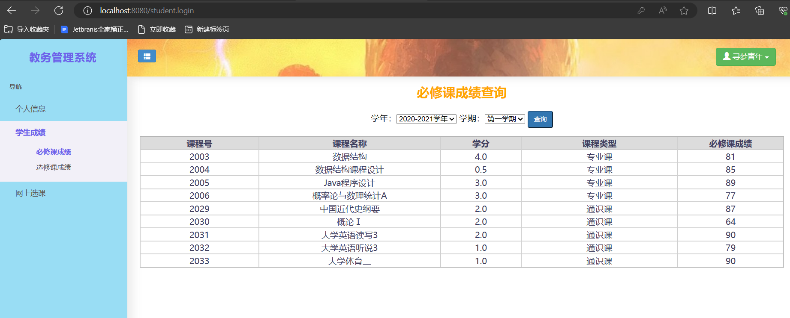
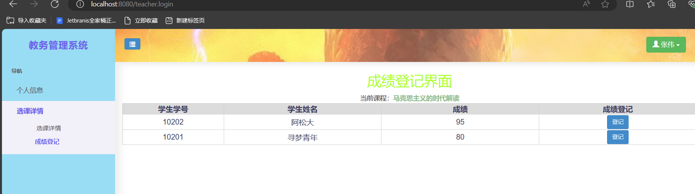
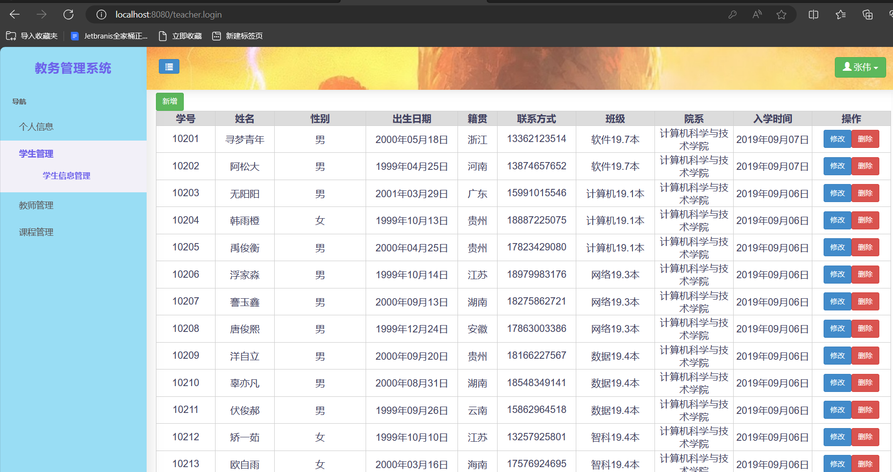
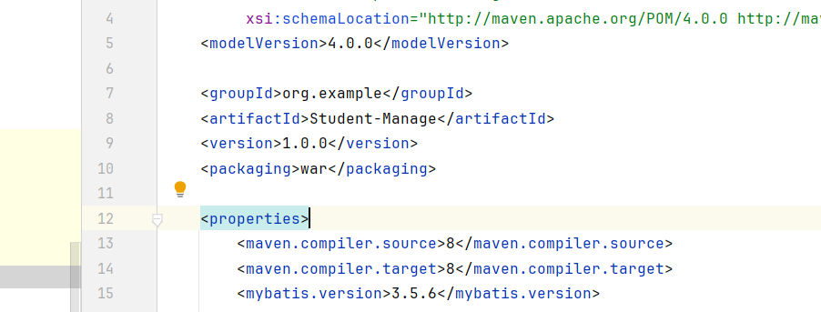
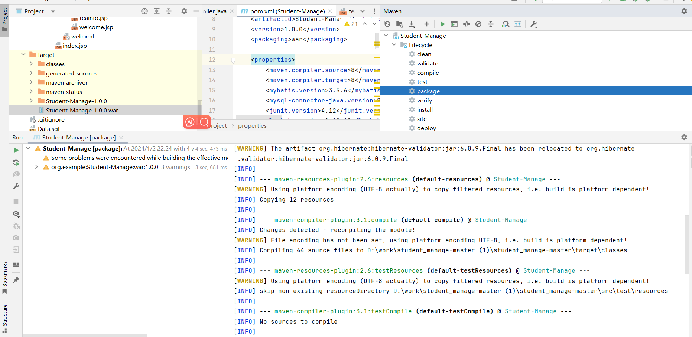
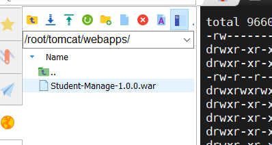
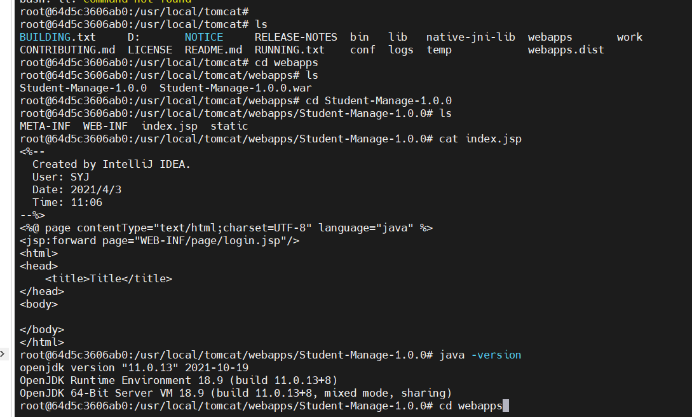
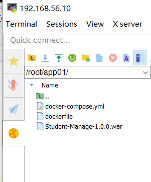
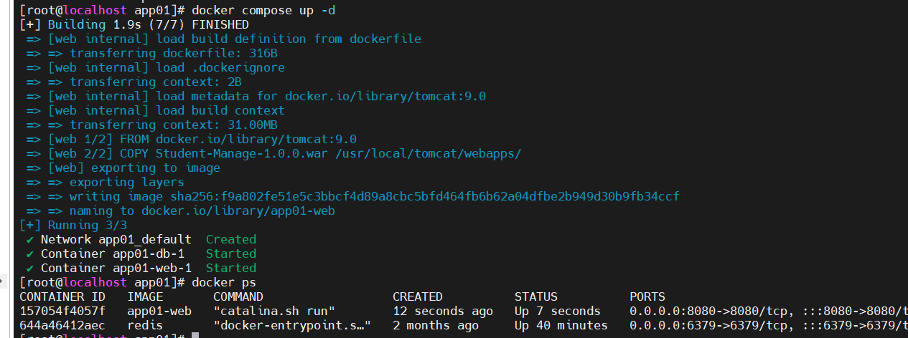

# student_manage
学生管理系统

效果展示图：


学生页面：



老师页面：



管理员页面：



# 使用docker启动student_manage项目

## 第一步拉镜像

这里用9.0版本作为演示

```bash
docker pull tomcat:9.0
```

## 第二步完美的创建容器

```bash
1.先简单运行一下tomcat
docker run -d -p 3355:8080 --name tomcat01 tomcat

2.创建挂载目录
mkdir -p /root/tomcat/conf
mkdir -p /root/tomcat/logs
mkdir -p /root/tomcat/webapps

3.拷贝
docker cp tomcat01:/usr/local/tomcat/conf /root/tomcat/   #docker的复制是把整个conf文件夹复制过来
docker cp tomcat01:/usr/local/tomcat/webapps /root/tomcat/   
docker cp tomcat01:/usr/local/tomcat/logs /root/tomcat/ 

4.关闭一开始创建的容器
docker stop tomcat01

5.重新创建一个完美容器
docker run --name tomcat -p 8080:8080 -v /root/tomcat/logs:/usr/local/tomcat/logs   -v /root/tomcat/webapps:/usr/local/tomcat/webapps -v /root/tomcat/conf:/usr/local/tomcat/conf -d tomcat:9.0
```

## 第三步生成war包



生成war包：



放在webapp里面。



重启一下docker即可

可以进一下docker，看一下情况。

```
docker exec -it tomcat /bin/bash
```



这样基本就没问题了,效果图：


这样就部署成功了，但是还要配置一波数据库。

这里就不展示了，我准备在项目中加个docker的compose文件，文件在项目的docker里面

结构如下：



然后执行：



结果如下：


可以看到已经部署成功了，接下来就是单纯的执行sql文件就行了。
